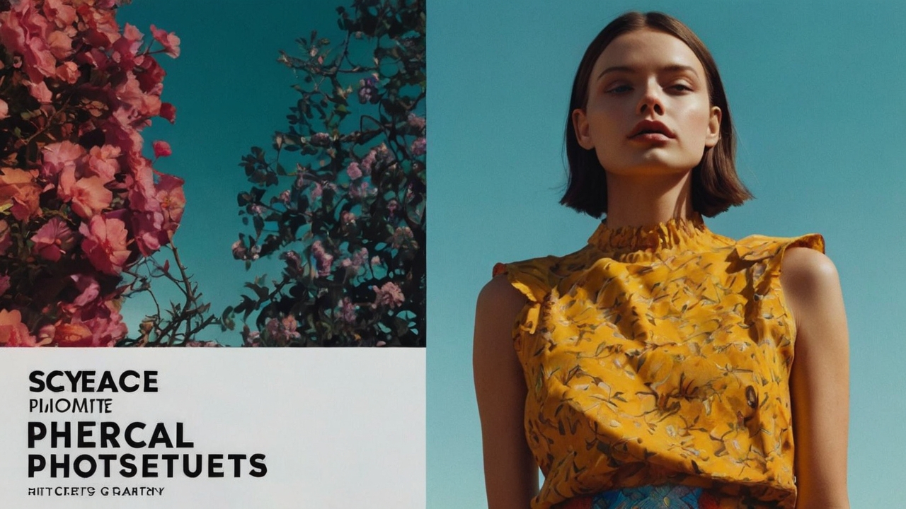

# PhotoTreasure
A Collection of Photography Resources

This repository is a curated collection of resources for photographers of all levels. It includes tutorials, software recommendations, plugin suggestions, preset packs, handy cheat sheets, and links to valuable online resources.

## Table of Contents

- [PhotoTreasure](#phototreasure)
  - [Table of Contents](#table-of-contents)
  - [Tutorials](#tutorials)
    - [Beginner](#beginner)
    - [Intermediate](#intermediate)
    - [Advanced](#advanced)
    - [Specific Techniques](#specific-techniques)
  - [Youtube](#youtube)
    - [Technology](#technology)
    - [Sinhala](#sinhala)
  - [Software](#software)
    - [Image Editing](#image-editing)
    - [Raw Processing](#raw-processing)
    - [Photo Management](#photo-management)
    - [Other Essential Tools](#other-essential-tools)
  - [Plugins](#plugins)
    - [Lightroom](#lightroom)
    - [Photoshop](#photoshop)
    - [Other Software](#other-software)
  - [Presets](#presets)
    - [Free Presets](#free-presets)
    - [Paid Presets](#paid-presets)
    - [How to Create Your Own Presets](#how-to-create-your-own-presets)
  - [Cheat Sheets](#cheat-sheets)
    - [Other Quick Reference Guides](#other-quick-reference-guides)
  - [Online Resources](#online-resources)
    - [Photography Websites and Blogs](#photography-websites-and-blogs)
    - [Forums and Communities](#forums-and-communities)
    - [Stock Photo Sites](#stock-photo-sites)
    - [Educational Platforms](#educational-platforms)

## Tutorials

### Beginner

- **YouTube Channels:**
  - Peter McKinnon: [Peter McKinnon YouTube Channel](https://www.youtube.com/user/petermckinnon)
  - Sorelle Amore: [Sorelle Amore YouTube Channel](https://www.youtube.com/channel/UCvS5bI5d7NfgNz4YTr5Z5Vg)
- **Online Courses:**
  - Udemy: [Udemy Photography Courses](https://www.udemy.com/topic/photography/)
  - Skillshare: [Skillshare Photography Courses](https://www.skillshare.com/browse/photography)
- **Simulations:**
  - Camerasim: [Camera simulation](https://www.camerasim.com/original-camerasim)
  - Andersenimages: [Exposure Simulator](http://www.andersenimages.com/tutorials/exposure-simulator/) | [DOF and Hyperfocal](http://www.andersenimages.com/tutorials/hyperfocal/) 
  - Dofsimulator: [DOF Simulator](https://dofsimulator.net/en/) 

### Intermediate

- Strobist: [Strobist Website](https://strobist.blogspot.com)
- Digital Photography School: [Digital Photography School](https://digital-photography-school.com)
- Phlearn: [Phlearn Website](https://phlearn.com)

### Advanced

- National Geographic Photography: [National Geographic Photography](https://www.nationalgeographic.com/photography)
- Lens Rentals Blog: [Lens Rentals Blog](https://www.lensrentals.com/blog/)
- The Online Photographer: [The Online Photographer](https://theonlinephotographer.typepad.com)

### Specific Techniques

- **Portrait Photography:**
  - SLR Lounge: [SLR Lounge Portrait Tutorials](https://www.slrlounge.com/category/education/portrait-photography/)
- **Landscape Photography:**
  - Capture the Atlas: [Capture the Atlas](https://capturetheatlas.com)
- **Macro Photography:**
  - YouTube Channel: Micael Widell: [Micael Widell's Macro Photography](https://www.youtube.com/@MicaelWidell)
- **Astrophotography:**
  - Astrobin: [Astrobin](https://www.astrobin.com)

## Youtube

### Technology
  
  - [Video Tech Explained](https://www.youtube.com/@VideoTechExplained)
  - [Camera Zone](https://www.youtube.com/@camerazone_)

### Sinhala
  - [Krishantha Dinesh](https://www.youtube.com/playlist?list=PLQb7r4ipXHqwzdtc9kKCkrSlLWEdNOxdZ)
  - [Institute of Multimedia Education](https://www.youtube.com/@ImeEduLk)

## Software

### Image Editing

- Adobe Photoshop: [Adobe Photoshop](https://www.adobe.com/products/photoshop.html)
- Affinity Photo: [Affinity Photo](https://affinity.serif.com/en-us/photo/)

### Raw Processing
- Free Open Source
  - RawTherapee: [RawTherapee](https://www.rawtherapee.com)
  - Darktable: [Darktable](https://www.darktable.org/)

- Paid
  - Adobe Lightroom: [Adobe Lightroom](https://www.adobe.com/products/photoshop-lightroom.html)
  - Capture One: [Capture One](https://www.captureone.com)

### Photo Management

- Adobe Bridge: [Adobe Bridge](https://www.adobe.com/products/bridge.html)
- Darktable: [Darktable](https://www.darktable.org)

### Other Essential Tools

- XnView MP: [XnView MP](https://www.xnview.com/en/xnviewmp/)
- IrfanView: [IrfanView](https://www.irfanview.com)

## Plugins

### Lightroom

- VSCO Film: [VSCO Film](https://vsco.co/film)
- Sleeklens: [Sleeklens Lightroom Presets](https://sleeklens.com)

### Photoshop

- Nik Collection: [Nik Collection](https://nikcollection.dxo.com)
- PortraitPro: [PortraitPro](https://www.portraitpro.com)

### Other Software

- ON1 Effects: [ON1 Effects](https://www.on1.com/products/effects/)
- Topaz Labs: [Topaz Labs](https://www.topazlabs.com)

## Presets

### Free Presets

- [Adobe Lightroom Free Presets](https://www.adobe.com/products/photoshop-lightroom/presets.html)
- [Photoshop Free Actions](https://www.photoshopessentials.com/photo-effects/)

### Paid Presets

- [Mastin Labs Presets](https://mastinlabs.com)
- [RNI Films](https://www.rnifilters.com)

### How to Create Your Own Presets

- [Creating Lightroom Presets](https://www.adobe.com/products/photoshop-lightroom/presets.html)
- [Creating Photoshop Actions](https://helpx.adobe.com/photoshop/using/actions.html)

## Cheat Sheets

- Photography & Camera Settings: [Shotkit](https://shotkit.com/photography-cheat-sheets/)

### Other Quick Reference Guides

- [Photography Cheat Sheets](https://www.photographyreview.com/photography-cheat-sheets/)

## Online Resources

### Photography Websites and Blogs

- [Digital Photography School](https://digital-photography-school.com)
- [Fstoppers](https://fstoppers.com)
- [PetaPixel](https://petapixel.com)

### Forums and Communities

- [Photography on the Net](https://photography-on-the.net)
- [Reddit Photography](https://www.reddit.com/r/photography/)
- [Photo.net](https://www.photo.net)

### Stock Photo Sites

- [Unsplash](https://unsplash.com)
- [Pexels](https://www.pexels.com)
- [Shutterstock](https://www.shutterstock.com)

### Educational Platforms

- [Coursera Photography Courses](https://www.coursera.org/courses?query=photography)
- [LinkedIn Learning Photography Courses](https://www.linkedin.com/learning/topics/photography)
